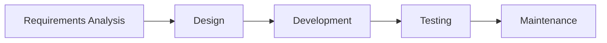

# Lecture 1: Introduction to Software Testing
#SoftwareTesting #University #ExamPrep #Lecture1

## 1. Common Myths
*   **Myth:** Testing is just clicking on random places.
*   **Myth:** Testing is *only* about finding bugs.
*   **Myth:** Testing is easy (a cakewalk).
*   **Myth:** Anyone can be a tester.
*   **Myth:** Testers have a low pay scale.
*   *Fact:* Testing requires technical skill, analytical thinking, and follows structured processes.

## 2. Key Definitions

### Software Testing
A process consisting of all **lifecycle activities** (static and dynamic) concerned with planning, preparation, and evaluation of a system to:
1.  Determine if they satisfy specified **requirements**.
2.  Demonstrate they are **fit for purpose**.
3.  **Detect defects**.

### Validation vs. Verification
*   **Verification:** Are we building the product **right**? (Conformity to specs).
*   **Validation:** Are we building the **right** product? (Satisfying user needs).

### Software Quality
The degree to which a system meets requirements and user expectations. It implies:
*   Minimum defects.
*   Degree of excellence.
*   Fitness for defined purposes.

## 3. Testing vs. Quality Control (QC) vs. Quality Assurance (QA)

| Feature | **Testing** | **Quality Control (QC)** | **Quality Assurance (QA)** |
| :--- | :--- | :--- | :--- |
| **Definition** | Activities to identify bugs/errors. | Activities to evaluate the quality of a component. | Activities to ensure quality in the *development process*. |
| **Focus** | Actual testing execution. | Detecting bugs via procedures/execution. | Processes and procedures (prevention). |
| **Nature** | **Reactive** process. | **Reactive** process. | **Proactive** process. |
| **Approach** | Testing team approach. | Testing team approach. | Whole team approach. |
| **Relationship**| Subset of QC. | Subset of QA. | The umbrella concept. |

## 4. Software Testing Life Cycle (STLC)

The STLC phases vary by management style, but generally follow this flow alongside the SDLC (Software Development Life Cycle):

**Core STLC Activities:**
1.  **Test Planning**
2.  **Test Analysis**
3.  **Test Design**
4.  **Test Implementation**
5.  **Test Execution**
6.  **Test Completion**
    *   *Note:* **Test Monitoring & Control** happens throughout all phases.

## 5. Objectives of Testing
*   Evaluating work products (requirements, user stories, code).
*   Triggering failures to find **defects**.
*   Ensuring required coverage of the test object.
*   **Reducing risk** of inadequate software quality.
*   Verifying compliance with regulations/contracts.
*   Providing information to stakeholders for decision-making.
*   Building **confidence** in quality.

## 6. Skills & Psychology

### Essential Skills
*   **Hard Skills:** Technical skills, Analytical skills, Domain knowledge.
*   **Soft Skills:** Communication (Verbal/Written), Diplomacy, Attention to detail, Persistence, Curiosity.

### The Psychology of Testing
*   **Goal:** Collaboration, not battles.
*   **Communication:** Report findings in a neutral, fact-focused way.
*   **Empathy:** Understand the developer's feelings; we share the common goal of quality.

### Mindsets
*   **Developer:** Focuses on the efficient way to *make it work*.
*   **Tester:** Focuses on different viewpoints, behavior patterns, and how to *break it*.

## 7. The 7 Principles of Testing
1.  **Testing shows the presence of defects:** It cannot prove that there are *no* defects.
2.  **Exhaustive testing is impossible:** You cannot test every single input combination (risk-based testing is used instead).
3.  **Early testing saves time and money:** Fixes are cheaper earlier in the lifecycle.
4.  **Defects cluster together:** A small number of modules usually contain most of the defects (Pareto Principle).
5.  **Tests wear out (Pesticide Paradox):** Repeating the same tests won't find new bugs; tests must be updated.
6.  **Testing is context dependent:** Testing a safety-critical app is different from testing an e-commerce site.
7.  **Absence-of-defects fallacy:** A bug-free system is useless if it doesn't meet the user's needs (Validation failure).