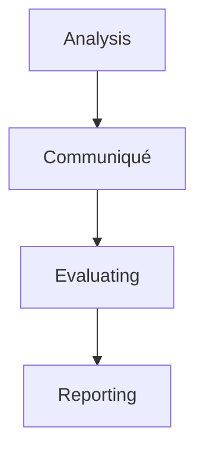

***

# Lecture 12: Test Metrics and Reporting
#TestManagement #Metrics #Reporting #Monitoring #Controlling #ExamPrep

## 1. Test Monitoring and Control
Two distinct but related processes performed by the Test Manager.

### Test Monitoring
The process of collecting, recording, and reporting information about project activities.
*   **Goal:** Compare actual performance against the plan.
*   **Activities:**
    *   Defining goals/performance standards.
    *   Observing performance.
    *   Recording and reporting detected problems.

### Test Control
The process of taking **corrective measures** based on monitoring results.
*   **Goal:** Fix deviations to bring performance back to the plan.
*   **Examples of Control Actions:**
    *   Prioritizing testing efforts.
    *   Revisiting schedules/dates.
    *   Reorganizing the test environment.
    *   Reprioritizing test cases.

### Key Parameters to Monitor
| Parameter | Description |
| :--- | :--- |
| **Cost** | Tracking estimates vs. actual budget to deliver within financial limits. |
| **Schedule** | Tracking timing, completion status, and sequence of activities. |
| **Resources** | Managing people and equipment required to complete tasks. |
| **Quality** | Monitoring work products (test cases, logs) against quality standards. |

## 2. Software Testing Metrics
A **Metric** is a quantitative measure of the degree to which a system or process possesses a given attribute. It estimates progress, quality, and health.

### Why do we need them?
*   To make decisions for the next phase.
*   To provide evidence for claims/predictions.
*   To identify required improvements.

### Types of Metrics
1.  **Process Metrics:** Improve the efficiency of the SDLC process.
2.  **Product Metrics:** Deal with the quality of the software product.
3.  **Project Metrics:** Measure efficiency of the team and tools.

### Metrics Lifecycle

1.  **Analysis:** Identify and define metrics and parameters.
2.  **Communiqué:** Explain needs to stakeholders; educate the team on data capture.
3.  **Evaluating:** Capture, verify, and calculate data.
4.  **Reporting:** Develop report with conclusions, distribute, and get feedback.

## 3. Calculating Metrics (Formulas)

### Execution Metrics
*   **% Test Cases Executed:**
    $$(\frac{\text{Test Cases Executed}}{\text{Total Test Cases Written}}) \times 100$$
*   **% Test Cases Pending:**
    $$(\frac{\text{Test Cases Not Executed}}{\text{Total Test Cases Written}}) \times 100$$

### Status Metrics (Based on Executed Cases)
*   **Pass Percentage:**
    $$(\frac{\text{Test Cases Passed}}{\text{Total Executed}}) \times 100$$
*   **Fail Percentage:**
    $$(\frac{\text{Test Cases Failed}}{\text{Total Executed}}) \times 100$$
*   **Blocked Percentage:**
    $$(\frac{\text{Test Cases Blocked}}{\text{Total Executed}}) \times 100$$

### Defect Metrics
*   **Defects by Priority:**
    $$(\frac{\text{Critical Defects}}{\text{Total Defects}}) \times 100$$

*   *Note:* **Visualization** (Pie charts, Bar charts) is essential for making these numbers understandable.

## 4. Test Summary Report
A document summarizing test activities, results, and an assessment of how well testing was performed.
*   **Purpose:** Helps stakeholders evaluate quality and decide on **Release** (Go/No-Go).

### Structure of a Good Report
1.  **Project Information:** Name, Description, Version.
2.  **Test Objective:** Test type (e.g., System, Performance) and purpose.
3.  **Test Summary:**
    *   Pass/Fail/Blocked counts.
    *   Total number of bugs.
    *   Bug breakdown (Severity/Priority).
4.  **Defect Details:** Description, Priority, Status of key open bugs.

### Writing Tips
*   **Specific:** Don't write an essay; focus on main points.
*   **Clear:** Use visualization; ensure data is understandable.
*   **Standard:** Use a template for consistency.
*   **Formal:** Use professional email guidelines.

## Key Takeaways
1.  **Monitoring** collects data; **Control** takes action.
2.  Metrics quantify quality and efficiency.
3.  **Visualization** is your best friend when reporting.
4.  The **Test Summary Report** is the critical instrument for release decisions.