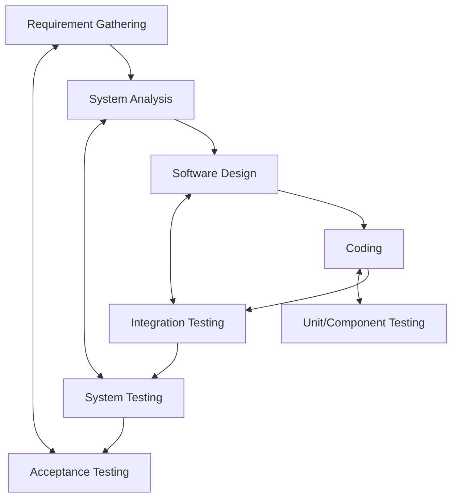

***

# Lecture 3: Test Types and Levels
#SoftwareTesting #ISTQB #TestLevels #TestTypes #ExamPrep

## 1. Test Levels & The V-Model
Test levels are groups of test activities organized and managed together. Each level corresponds to a phase in the Software Development Life Cycle (SDLC).

**The V-Model Relationship:**
Testing is not just a final step; it mirrors development phases.

## 2. Test Types Overview
A **Test Type** is a group of activities aimed at testing specific characteristics of a system.

| Test Type | Objective | Question Asked |
| :--- | :--- | :--- |
| **Functional** | Evaluate functional quality (correctness, completeness). | *"What does the system do?"* |
| **Non-Functional** | Evaluate attributes like reliability, speed, usability. | *"How well does the system work?"* |
| **Structural (White Box)** | Evaluate internal structure/architecture. | *"How is the system built?"* |
| **Change-Related** | Confirm fixes and check for regressions. | *"Does it work after the change?"* |

*Note: Any Test Type can be performed at any Test Level.*

## 3. Functional vs. Non-Functional

### Functional Testing
*   **Focus:** The behavior of the software ("What").
*   **Basis:** Requirements, User Stories, Use Cases.
*   **Technique:** Primarily **Black-box**.
*   **When:** Performed at **all** test levels.

### Non-Functional Testing
*   **Focus:** The characteristics of the software ("How well").
*   **Importance:** Late discovery of non-functional defects can be dangerous/expensive.
*   **Attributes (Quality Characteristics):**
    *   **Reliability:** Availability, Fault tolerance, Recoverability.
    *   **Performance:** Time behavior, Resource utilization, Capacity.
    *   **Usability:** Learnability, Operability, Accessibility.
    *   **Maintainability:** Modularity, Testability.
    *   **Security:** Confidentiality, Integrity, Accountability.
    *   **Compatibility:** Interoperability.
    *   **Portability:** Installability, Adaptability.

## 4. Testing Approaches (The Boxes)

| Feature | **Black Box** | **White Box** | **Gray Box** |
| :--- | :--- | :--- | :--- |
| **Knowledge** | No knowledge of internal code/structure. | Full knowledge of internal structure/code. | Partial knowledge (data structures, algorithms). |
| **Basis** | Requirements & Behavior. | Code, Architecture, Data Flows. | High-level & Detailed design docs. |
| **Focus** | Input/Output & User perspective. | Code coverage, Branch coverage, Logic. | APIs, Database, Web Apps. |
| **Dependence**| Strong dependence on **Requirements**. | Strong dependence on **Code**. | Intelligent Test Authoring. |

## 5. Change-Related Testing

When changes are made (fixes or new features), two types of testing occur:

1.  **Confirmation Testing (Re-test):**
    *   Executing the *same* test cases that failed previously.
    *   **Goal:** Verify the specific defect is fixed.
2.  **Regression Testing:**
    *   Testing *other* parts of the system.
    *   **Goal:** Ensure the change didn't break existing functionality.

**Classifications:**
*   **Smoke Testing:** Covers crucial functionality (Go/No-Go).
*   **Sanity Testing:** Verifies a specific logical group of functions/fixes.

## 6. Detailed Breakdown of Test Levels

| Level | **Component (Unit)** | **Integration** | **System** | **Acceptance** |
| :--- | :--- | :--- | :--- | :--- |
| **Objective** | Find defects in logic/code; reduce risk. | Check interfaces & interactions between components/systems. | Verify functional & non-functional behavior of the *whole* system. | Validate system is complete and works for the user (Business process). |
| **Test Objects** | Units, Classes, Code, Data Structures. | Subsystems, APIs, Microservices, Interfaces. | Full Application, OS, Hardware/Software config. | Business processes, Recovery systems, Operational processes. |
| **Responsibility**| **Developers**. | **Developers** (Component Int.) or **Testers** (System Int.). | **Independent Testers**. | **Customers**, Business Users, Product Owners. |
| **Environment** | Development Environment. | Dev/Test Environment. | Test Environment. | Production-like Environment (Staging). |

### Key Takeaways
*   **Component Testing:** Usually White Box.
*   **System Testing:** Relies heavily on specifications.
*   **Acceptance Testing:** The final check before go-live; verifies the system is "fit for purpose."