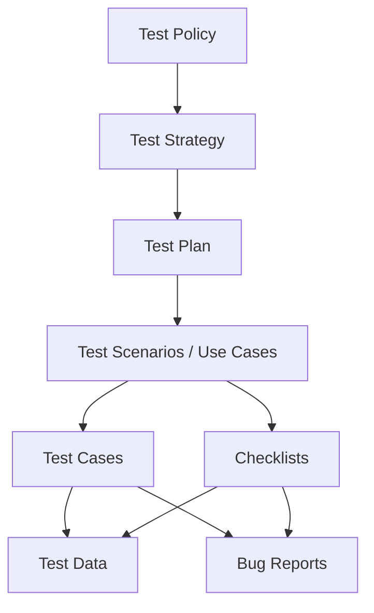

***

# Lecture 4: Test Documentation
#SoftwareTesting #Documentation #TestPlan #BugReport #ExamPrep

## 1. What is Test Documentation?
A set of artifacts prepared before and during the testing process.
*   **Purpose:** Describes coverage, tracks issues, assigns responsibility, and keeps chaos in "formal order."
*   **Benefit:** Allows any team member to understand past, present, and future testing activities.
*   **Golden Rule:** Keep it simple and sufficient. Don't overload it with unnecessary details.

## 2. Hierarchy of Documentation

## 3. High-Level Documentation

### A. Test Policy
*   **Level:** Organization-level.
*   **Author:** Senior Test Management.
*   **Content:** Principles, methods, and testing goals of the *entire organization*.
*   **Goal:** Justify the cost of quality and define measuring methods.

### B. Test Strategy
*   **Level:** Project/Planning level.
*   **Content:** Scope, approach, resources, and schedule.
*   **Note:** Can be a standalone document or a subsection of the **Test Plan**.

### C. Test Plan
*   **Level:** Project level.
*   **Content:** Identifies **Test Levels** to be executed.
*   **Key Components:**
    *   Features to be tested (and NOT tested).
    *   Test schedule & priorities.
    *   Roles and responsibilities.
    *   **Entry/Exit criteria.**
    *   Risks and mitigation.
    *   Tools and Environment.

## 4. Low-Level (Execution) Documentation

### A. Test Scenario
*   **Definition:** An item or event of a software system verified by test cases. Represents an **End-to-End** interaction (User flow).
*   **Based on:** Business/System requirements and User Experience assumptions.
*   **Includes:** Happy paths (Main success) and Alternative paths (Failure handling).

### B. Test Case
*   **Definition:** A set of specific actions to verify a feature based on a scenario.
*   **Key Attributes:**
    *   **ID & Name:** Self-explanatory.
    *   **Preconditions:** Setup required *before* testing (e.g., "User is logged in").
    *   **Test Steps:** Step-by-step instructions.
    *   **Expected Result:** What *should* happen.
    *   **Status:** Pass/Fail/Blocked.
    *   **Postcondition:** System state *after* the test (useful for automation).

### C. Checklist
*   **Definition:** A simplified version of a test case.
*   **Format:** A list of verifications without detailed steps.
*   **Use Case:** Best for simple maintenance or when time is short.

| Feature | **Test Case** | **Checklist** |
| :--- | :--- | :--- |
| **Detail Level** | High (Step-by-step). | Low (List of items). |
| **Maintenance** | Harder to maintain. | Easy to create and scale. |
| **Risk** | Lower risk of missing details. | Higher risk if logic is complex ("Devil is in the details"). |
| **Usage** | Complex flows, Regression suites. | Smoke tests, simple verifications. |

## 5. Defect Documentation: The Bug Report
A document providing full information about a bug to help developers reproduce and fix it.

**Essential Fields:**
1.  **Summary:** meaningful, brief explanation of the error.
2.  **Environment:** Version, Build, OS, Browser.
3.  **Severity & Priority:** How bad is it? How fast must it be fixed?
4.  **Preconditions:** State of the system before the bug occurs.
5.  **Steps to Reproduce:** Detailed actions to trigger the bug.
6.  **Actual Result:** What actually happened (the error).
7.  **Expected Result:** What *should* have happened.
8.  **Attachments:** Logs, Screenshots, Videos.