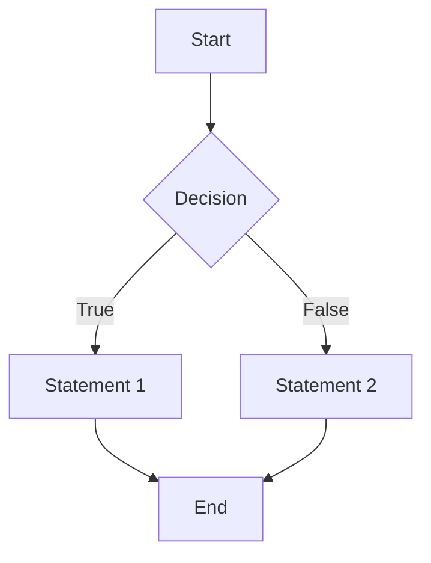

***

# Lecture 5: Test Design Techniques
#SoftwareTesting #TestDesign #BlackBox #WhiteBox #ISTQB #ExamPrep

## 1. Definitions & Goals
*   **Test Design:** The process of transforming general testing objectives into tangible test cases and conditions.
*   **Test Design Technique:** A procedure used to derive and select test cases.
*   **Goal:** Provide **optimal test coverage** (cover all functionality) with **minimal** test cases.

## 2. Categories of Techniques

| Category | AKA | Description | Focus |
| :--- | :--- | :--- | :--- |
| **Black-box** | Behavioral | Based on requirements, specs, user stories. | Inputs & Outputs (No knowledge of code). |
| **White-box** | Structural | Based on architecture, detailed design, code. | Internal structure & processing logic. |
| **Experience-based** | N/A | Based on skills/experience of testers/users. | Ad-hoc, often combined with others. |

---

## 3. Black-Box Techniques

### A. Equivalence Partitioning (EP)
Divides input/output data into partitions where the system behavior is assumed to be the same.
*   **Goal:** Reduce the number of test cases by selecting one representative from each class.
*   **Coverage:** Must cover **Valid** (accepted) and **Invalid** (rejected) classes.
*   **Example:**
    *   *Rule:* Fee is 5% for transfers between $70k and $100k.
    *   *Class:* $[70,000 ... 100,000)$
    *   *Test:* Select one value, e.g., $80,000$.

### B. Boundary Value Analysis (BVA)
Tests the behavior at the **edges** of equivalence partitions.
*   **Why:** Errors often hide at the boundaries.
*   **Techniques:**
    *   **2-value BVA:** Test the boundary + closest neighbor (e.g., `100`, `101`).
    *   **3-value BVA:** Test the boundary + both neighbors (e.g., `99`, `100`, `101`).
*   **Example:**
    *   *Boundary:* $100,000.
    *   *Tests:* $99,999.99 (Lower bracket), $100,000.00 (Upper bracket), $100,000.01 (Next bracket).

### C. Pairwise Testing
A technique to test all possible discrete combinations of **each pair** of input parameters.
*   **Use Case:** When the total number of combinations is too large to test exhaustively.
*   **Theory:** Most defects are single-mode (one function fails) or double-mode (interaction of two functions fails).
*   **Tools:** Tools like **PICT** are used to generate these sets.
*   **Math:** Instead of testing $7 \times 3 \times 2 \times 2 \times 3 = 252$ combinations, you test ~31 optimized pairs.

### D. Decision Table Testing
Used to capture complex business rules and logic.
*   **Structure:** Connects combinations of **Conditions** (Inputs) with **Actions** (Outputs).
*   **Rules:** Each column represents a rule (a unique combination of conditions).
*   **Calculation:** Number of Rules = $(\text{Number of Values})^{\text{Number of Conditions}}$.
    *   *Example:* 3 boolean conditions ($2^3$) = 8 Rules.
*   **Benefits:** Guarantees 100% coverage of logic combinations; helps identify logical gaps or contradictions in requirements.

| Conditions | Rule 1 | Rule 2 | Rule 3 |
| :--- | :--- | :--- | :--- |
| User is VIP? | Y | Y | N |
| Coupon Valid? | Y | N | Y |
| **Action: Discount** | **20%** | **10%** | **5%** |

### E. State Transition Testing
Used for systems with finite states where output depends on the current state and an event.
*   **Components:**
    1.  **States:** (e.g., Made, Paid, Ticketed, Cancelled).
    2.  **Transitions:** Movement from one state to another.
    3.  **Events:** Triggers (e.g., "payMoney").
    4.  **Actions:** Result of transition (e.g., "Generate Ticket").
*   **Artifacts:** State Transition Diagram (visual) or State Table (matrix of States vs. Events).
*   **Coverage Levels:**
    *   All states visited.
    *   All valid transitions exercised (0-switch coverage).
    *   All transitions (Valid + Invalid) exercised (Best coverage).

---

## 4. White-Box Techniques (Overview)
Focuses on the internal logic of the code.

*   **Statement Testing:** Ensures every executable statement in the code is run at least once.
*   **Branch Testing:** Ensures every decision outcome (True/False edges) is executed. (Branch coverage is stronger than Statement coverage).

*   *Statement Coverage:* Hit C and D.
*   *Branch Coverage:* Hit the "True" arrow and the "False" arrow.