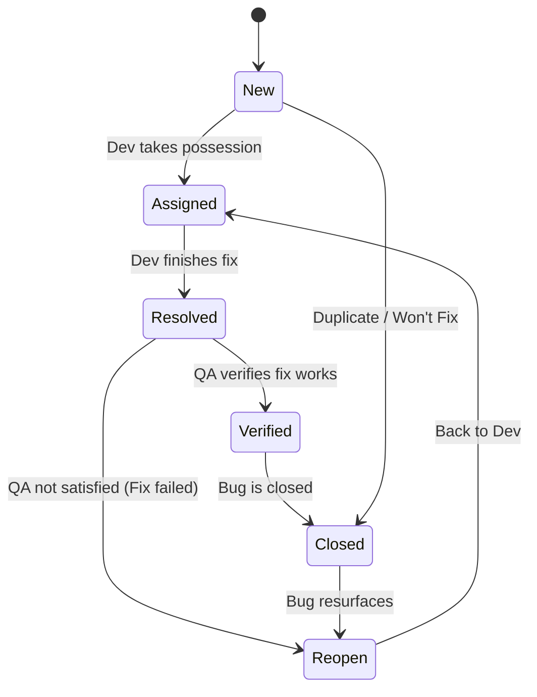

***

# Lecture 7: Defects and Bug Tracking Systems
#SoftwareTesting #DefectManagement #BugReport #JIRA #ExamPrep

## 1. Key Definitions (The Terminology)
*   **Mistake (Error):** A human action that produces an incorrect result (e.g., developer makes a typo).
*   **Defect (Bug):** An error, flaw, or fault in the computer program caused by the mistake. An inconsistency between *Actual* and *Expected* behavior.
*   **Failure:** The deviation of the component or system from its expected delivery, service, or result (The user sees this).
*   **History:** The first actual case of a bug was a moth stuck in the Harvard Mark II relay, recorded by Grace Hopper in 1947.

> **Flow:** Mistake $\rightarrow$ Defect $\rightarrow$ Failure

## 2. The Bug Report
A document reporting a flaw in a component or system.
**Purposes:**
1.  **Notification:** Inform the dev team/stakeholders.
2.  **Prioritization:** Define impact and fix timeline.
3.  **Assistance:** Help developers analyze and reproduce the root cause.

### Anatomy of a Bug Report
| Field | Description |
| :--- | :--- |
| **Defect ID** | Unique identification number. |
| **Summary** | Short description. Must answer: **What? Where? When?** |
| **Affected Version** | The version where the bug was found. |
| **Fix Version** | The target version for the fix. |
| **Severity** | Technical impact on the system. |
| **Priority** | Business urgency to fix. |
| **Status** | Current state (e.g., Open, In Progress, Closed). |
| **Preconditions** | Setup required *before* attempting reproduction. |
| **Steps to Reproduce (STR)** | Numbered, clear instructions to trigger the bug. |
| **Actual Result** | What actually happened (the error). |
| **Expected Result** | What *should* have happened (based on requirements). |
| **Attachments** | Logs, screenshots, videos. |

### Best Practices for Reporting
*   **One problem per report:** Do not group multiple bugs.
*   **Reproduce first:** Ensure it wasn't a fluke before reporting.
*   **Be neutral:** Focus on facts, don't be rude or criticize the developer.
*   **Cross-browser:** Mention specific browsers/OS (e.g., "[IE10] Login button shifted").
*   **Attachments:**
    *   *Screenshots:* Highlight the specific area.
    *   *Logs:* Use .txt files (avoid .docx).
    *   *Video:* Keep it short, show only the bug actions.

## 3. Severity vs. Priority
This is a critical distinction in testing.

| **Severity** | **Priority** |
| :--- | :--- |
| **Definition:** Degree of impact on the development or operation of the system. | **Definition:** Level of business importance; how fast it must be fixed. |
| **Focus:** Technical aspect. | **Focus:** Business/Scheduling aspect. |
| **Levels:** 1. Blocker 2. Critical 3. Major 4. Minor 5. Trivial | **Levels:** 1. High 2. Medium 3. Low |

*   *Example:* A typo in the company logo on the homepage is **Low Severity** (doesn't crash the app) but **High Priority** (bad for brand image).

## 4. Bug Life Cycle
The workflow a bug goes through from discovery to closure.

## 5. Bug Resolutions
When a developer or manager updates a ticket, they assign a resolution:
*   **Fixed:** Code modified to fix the issue.
*   **Won't Fix:** Business decision to accept the bug (e.g., too expensive to fix, low value).
*   **Can't Reproduce:** Developer cannot make the bug happen on their machine.
*   **By Design:** Not a bug; the system is working as specified.
*   **Duplicate:** The issue was already reported.
*   **External:** Caused by a 3rd party system, not the software itself.

## 6. Bug Tracking Systems
Tools used to receive, file, and track bugs.
*   **Examples:** JIRA, Mantis, Azure DevOps, Bugzilla, Trello.